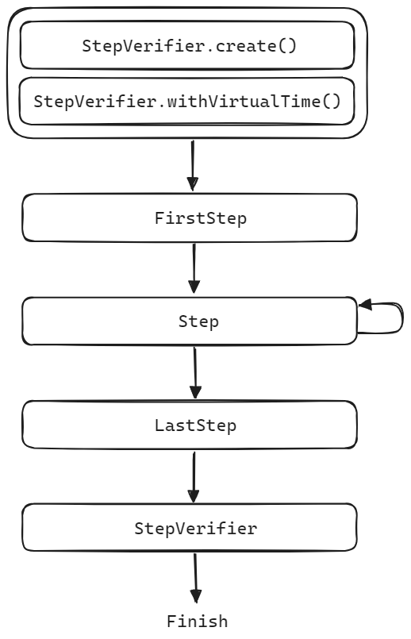
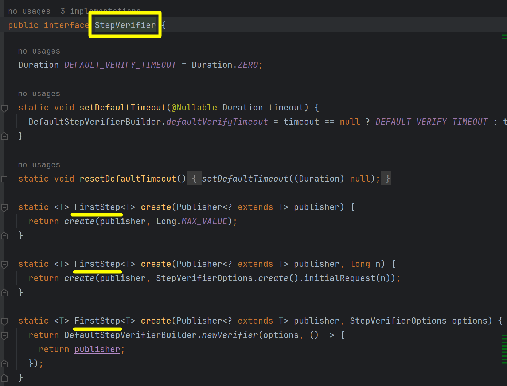
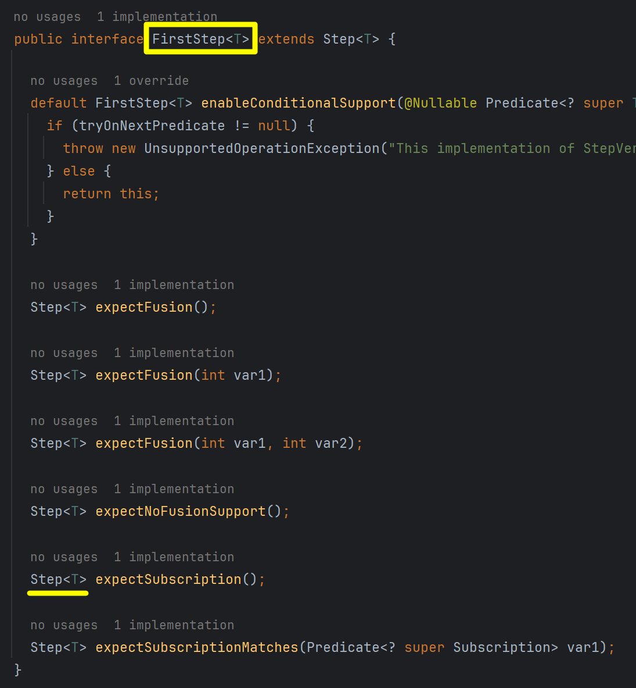
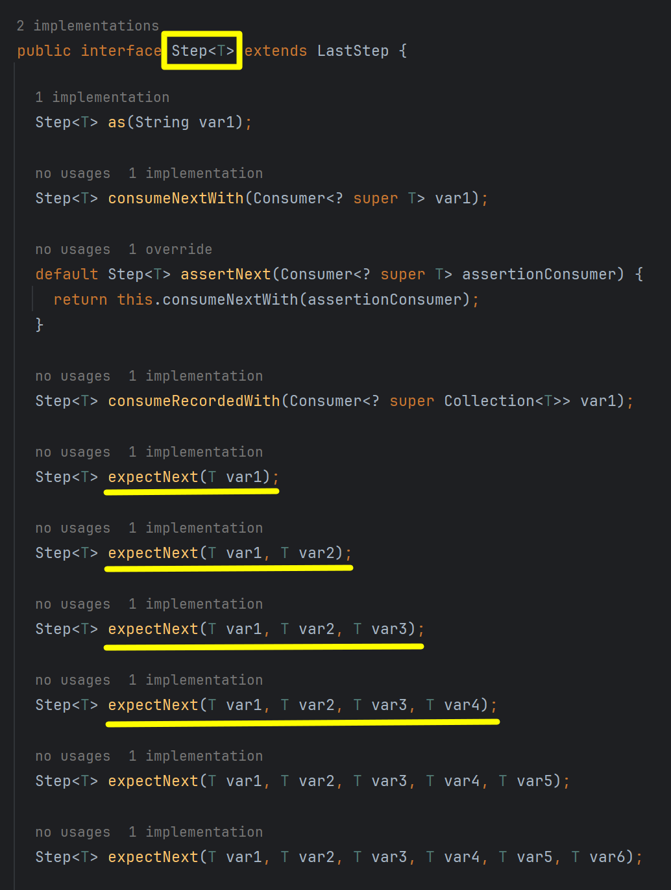
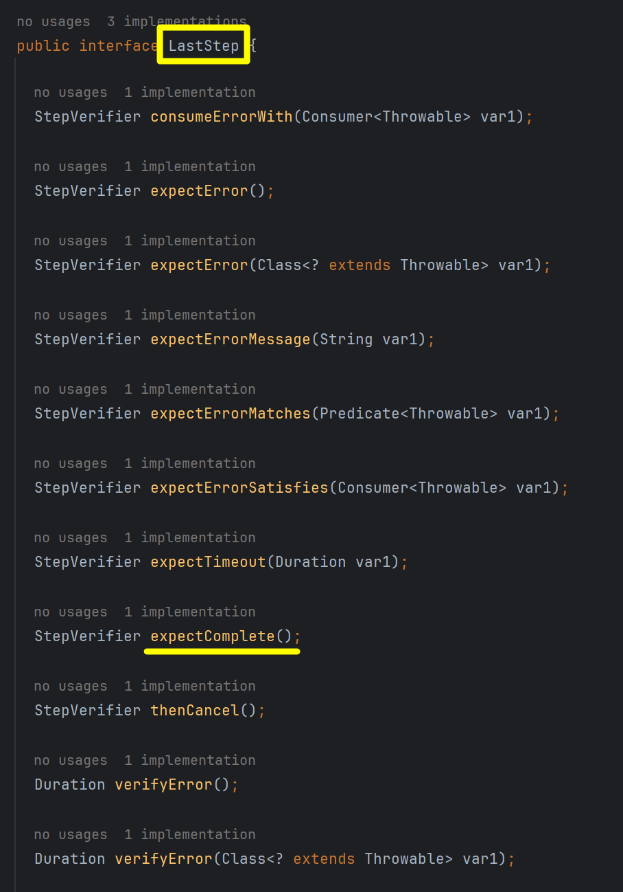
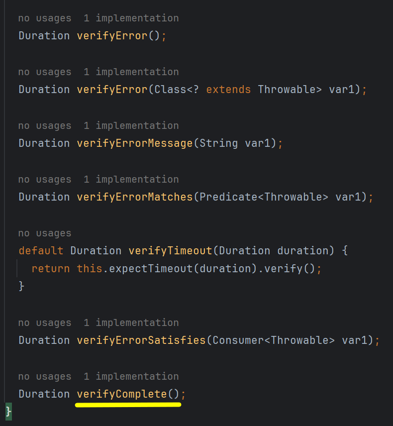
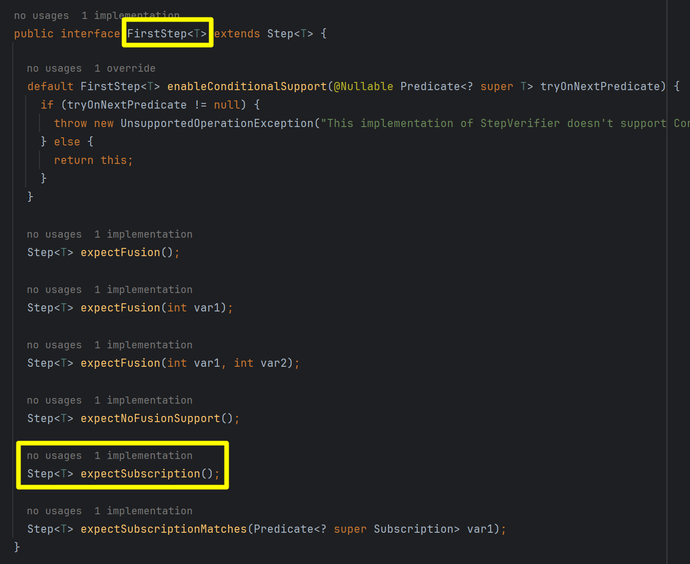

## StepVerifier 테스트 

StepVerifier 를 기반으로 테스트를 수행하면 Publisher 를 다양한 방식들로 활용해서 여러가지 이벤트를 활용해서 검증이 가능해집니다.<br/>


## 실행 방식



**StepVerifier.create(), StepVerifier.withVirtualTime()**<br/>

Publisher 를 생성하는 것은 StepVerifier.create() 또는 StepVerifier.withVirtualTime() 을 통해 생성합니다.<br/>

**FirstStep, Step, LastStep**<br/>

StepVerifier 는 FirstStep, Step, LastStep 으로 구성됩니다. 

FirstStep<br/>

- FirstStep 은 처음 받는 이벤트인 onSubscription 과 관련된 객체입니다.

Step<br/>

- Step 은 이후에 들어오는 이벤트 들을 순차적으로 검증할 때 사용하는 객체입니다.

LastStep<br/>

- LastStep 은 최종 결과를 검증할 때 사용합니다.


위의 검증이 모두 실패하면 테스트는 실패합니다.<br/>

StepVerifier 내부의 코드를 보면, create() 메서드는 FirstStep 을 반환한다는 사실을 알 수 있습니다.



<br/>

FirstStep 타입(interface) 내에서는 expectSubscription() 메서드의 리턴 값은 `Step<T>` 을 리턴한다는 사실을 알 수 있습니다. expectSubscription() 을 통해 subscription 을 시작하게 되면 onNext 이벤트가 내부적으로 발생하게 됩니다. <br/>

또는 expectSubscription() 을 명시적으로 호출하지 않아도 FirstStep 타입은 Step 타입을 상속하고 있기 때문에 Step 타입내의 expectSubscription() 없이 바로 expectNext() 메서드를 통해 onNext 이벤트를 발생시키는 것이 가능합니다.<br/>



<br/>


Step 타입(interface) 내에서는 exepectNext() 메서드를 통해 onNext 이벤트를 처리하며, 그 다음 onNext 이벤트 들을 체이닝 방식으로 처리가 가능하도록 `Step<T>` 을 리턴하고 있다는 사실을 확인 가능합니다.



<br/>


다음은 LastStep 입니다. LastStep 에서는 complete(), verifyComplete() 메서드를 제공하고 있습니다.



<br/>




<br/>


## FirstStep

### 내부 정의

StepVerifier 내부의 코드를 보면, StepVerifier 의 create() 메서드는 FirstStep 을 반환한다는 사실을 알 수 있습니다. FirstStep 타입의 객체는 이렇게 StepVerifier 의 create() 메서드를 통해서 생성가능합니다.<br/>


위의 캡처에서 가장 마지막의 create() 메서드를ㄹ 보면 FirstStep 을 생성 시에는 Subscription 에 전달할 requet 수, StepVerifierOptions 를 인자로 받고 있습니다.<br/>

StepVerfierOptions 클래스를 이용하면, `initialRequest` 필드를 이용해서 Subscription 에 전달할 request 수를 지정할 수 있고, `withInitialContext` 필드를 이용해서 Context 등과 같은 별도의 정보들을 지정하는 것 역시 가능합니다.<br/>

FirstStep 타입 내에는 expectSubscription() 이라는 메서드가 존재합니다.



이 expectSubscription() 메서드는 onSubscribe 이벤트에 대한 테스트 메서드 입니다. expectSubscription 메서드를 호출한 이후부터는 Step 을 이용해서 계속해서 체이닝이 가능해지게 됩니다. FirstStep 은 Step 을 상속하고 있기 때문에 expectSubscriptio() 메서드를호출하지 않고도 바로 다음단계인 Step 으로 넘어가는 것 역시 가능합니다.<br/>


### e.g. expectNext

Step 에서 테스트해볼 내용이지만, 이번 섹션에서는 단순한 예제를 하나 정리해봅니다.

```java
@Test
public void TEST_FIRST_STEP_SIMPLE_1(){
    Flux<Integer> numbers = Flux.range(0, 11);

    StepVerifier.create(numbers)
        .expectSubscription()
        .expectNext(0,1,2,3,4)  // 1)
        .expectNextCount(3) 	// 2) 실제 값 : 5,6,7
        .expectNext(8,9,10)     // 3) 
        .verifyComplete();
}
```

<br/>

1\)

- expectNext 를 통해서 0, 1, 2, 3, 4 의 값을 받습니다. onNext 이벤트가 5번 발생했다는 의미와 같습니다.

2\)

- expectNextCount 를 통해서 3 개의 요소를 받습니다. expectNextCount(count) 메서드 내에 count 로 명시한 값은 뒤에서 몇개의 값을 onNext로 더 받을지를 의미합니다.

3\)

- expectNext 를 통해서 8, 9, 10 의 값을 받습니다.

<br/>


### e.g. initialRequest

테스트하려는 Flux 의 크기를 알 수 없는 경우가 있습니다. 이런 경우 테스트 하려는 Flux 중에서 몇번째 까지만을 테스트할지를 명시할 수 있습니다. 아래 코드 처럼 `StepVerifier.create(flux, initialRequestSize)` 형태의 StepVerifier.create 메서드를 사용하면 **"Flux 의 맨 처음 요소부터 initialRequestSize 까지를 onSubscribe 이벤트 발생시 읽어들인다"** 라는 의미가 됩니다. 그리고 그 뒤의 요소는 꼭 `thenCancel().verify()` 등과 같은 종료연산을 통해 종료를 시켜줘야 합니다.

```java
@Test
public void TEST_FIRST_STEP_SIMPLE_2(){
    Flux<Integer> numbers = Flux.range(0, 11);
    var initialRequestSize = 3;

    StepVerifier.create(numbers, initialRequestSize)
        .expectSubscription()
        .expectNext(0, 1, 2).as("first")
        .thenCancel()
        .verify();

    StepVerifier.create(numbers, initialRequestSize)
        .expectNext(0).as("1 of 3")
        .expectNext(1).as("2 of 3")
        .expectNext(2).as("3 of 3")
        .thenCancel()
        .verify();
}
```

그런데 만약 thenCancel().verify() 대신 verifyComplete() 같은 메서드를 사용할 경우 테스트는 멈추지 않고 계속 무한히 수행됩니다. 데이터의 끝을 모르는 채로 StepVerifier 가 Flux 퍼블리셔를 구독하고 있게 되기 때문입니다.<br/>


## StepVerifierOptions

FirstStep 을 이용해서 Step 을 생성할 때에는 StepVerifierOptions 를 이용해서 initialRequest 와 같은 옵션을 지정해줄 수 있습니다.

```java
@Test
public void TEST_FIRST_STEP_VERIFIER_OPTIONS(){
    // 1)
    StepVerifierOptions option = StepVerifierOptions.create()
        .initialRequest(3)
        .checkUnderRequesting(false)
        .scenarioName("simple 2");

    Flux<String> message = Flux.just("A","B","C","D","E");

    // 2)
    StepVerifier
        .create(message, option)
        .expectSubscription()
        .expectNext("A","B","C").as("first")
        .thenRequest(2)
        .expectNextCount(2).as("second")
        .expectComplete()
        .verify();

    // 3)
    StepVerifier
        .create(message, option)
        .expectSubscription()
        .expectNext("A","B","C").as("first")
        .thenCancel()
        .verify();
}
```

StepVerifierOptions 의 initialRequest 를 지정해주면, 데이터의 크기를 알수없는 Flux 에 대해 전체 Flux 를 소모하는 것이 아니라 필요한 부분만을 소모해서 테스트 후 테스트를 종료할 수 있습니다. 실제 서비스 운영시에는 읽어와야 할 데이터의 사이즈를 알수 없는 경우가 많습니다. 이런 경우 필요한 부분까지만 읽어들이고 중지해서 과도한 리소스 소모를 방지합니다.<br/>

그런데 만약 thenCancel().verify() 대신 verifyComplete() 같은 메서드를 사용할 경우 테스트는 멈추지 않고 계속 무한히 수행됩니다. 데이터의 끝을 모르는 채로 StepVerifier 가 Flux 퍼블리셔를 구독하고 있게 되기 때문입니다.<br/>

1\)

- initialRequest 에 대해 3개의 요소를 request 하고 있습니다. 이렇게 지정하면 3개의 요소를 onSubscribe 이벤트 발생시에 request 하겠다는 의미입니다.

2\)

- expectSubscription() 은 생략하고 바로 expectNext(), expectNextCount() 를 사용가능합니다. 다만 onSubscribe 이벤트에 대한 동작을 정의한 Publisher 를 사용중이라면 expectSubscription() 메서드를 꼭 사용해야 올바른 테스트 결과를 얻을 수 있습니다.

- initialRequest 를 3 으로 지정했기에, 여기에서 5 개의 Flux 내의 item 들 중 3개의 item 들을 처음으로 request 합니다. 그리고 2개가 남아 있는데, 남아있는 2개의 요소는 thenRequest 를 통해 2개의 요소를 request 하고 expectNextCount 구문을 통해 검증을 수행했습니다.
- 이렇게 뒤에 남아있는 요소가 있을 때에는 꼭 thenRequest() 또는 thenCancel() 을 통해서 Flux 퍼블리셔를 꼭 종료시켜줘야 합니다.

3\)

- initialRequest 가 3 인 StepVerifierOptions 를 이용해서 request 했습니다. 이때 첫 subscribe 시 3 개의 요소만 request 한 상태입니다.
- 그리고 이 후의 테스트는 데이터의 사이즈가 얼마가 될지 얼마나 클지 확인할수 없는 상황이라고 가정하고 thenCancel() 과 verify() 를 이용해 종료시켜줬습니다.

<br/>


## Step

### Step 의 다양한 메서드

Step 타입 내에는 as(String description), then(Runnable task), thenRequest(long n) 메서드가 제공됩니다.

as(String description)

- 이전 step 에 description 을 추가합니다. 테스트 실패시에 as 에 넘겨진 description 이 로그에 나타나게 됩니다.

then(Runnable task)

- 이전 step 이후(e.g. expectNext, expectNextCount)에 Runnable 코드를 인자로 받아서 실행하는 메서드 입니다.

thenRequest(long n)

- 이전 step 이후(e.g. expectNext, expectNextCount)에 n 만큼의 request 를 수행합니다. 


예제는 위에서 살펴봤던 예제로 대체합니다.<br/>

e.g.

```java
@Test
public void TEST_FIRST_STEP_VERIFIER_OPTIONS(){
    // 1)
    StepVerifierOptions option = StepVerifierOptions.create()
        .initialRequest(3)
        .checkUnderRequesting(false)
        .scenarioName("simple 2");

    Flux<String> message = Flux.just("A","B","C","D","E");

    // 2)
    StepVerifier
        .create(message, option)
        .expectSubscription()
        .expectNext("A","B","C").as("first")
        .thenRequest(2)
        .expectNextCount(2).as("second")
        .expectComplete()
        .verify();

    // 3)
    StepVerifier
        .create(message, option)
        .expectSubscription()
        .expectNext("A","B","C").as("first")
        .thenCancel()
        .verify();
}
```

<br/>


### onNext

StepVerifier 로 테스트를 수행할 때 그 다음 요소들을 검사할 수 있는 메서드를 잘 알고 있어야 테스트 코드 작성이 수월해집니다. 아래는 onNext 이벤트에 대한 기능을 수행하는 Step 내의 메서드 들입니다.

- assertNext : item 의 값을 검증합니다. java 의 `Consumer` 를 이용해서 assert 문을 수행하는 방식을 ㅗ작성합니다.
- expectNext : 한개 이상의 item 을 값과 순서를 맞춰서 비교하는 메서드 입니다. 가변 인자를 이용해서 여러개의 값을 받는 것이 가능합니다.
- expectNextCount (count) : count 에 지정한 수 만큼 onNext 이벤트가 발생하는지를 검증합니다.
- expectNextSequence : iterable 의 element 들을 onNext 로 전달되는 item 들과 값과 순서를 모두 맞춰 비교합니다.
- expectNextMatches : onNext 이벤트를 통해 전달된 item 을 비교해서 true/false 를 리턴합니다.

<br/>


아래는 예제입니다. 간단하기에 설명은 생략합니다.

e.g. 

```java
@Test
public void TEST_STEP_ON_NEXT_EXAMPLE_1(){
    final Logger log = LoggerFactory.getLogger(WitStepVerifierTest.class);

    Flux<Integer> numbers = Flux.range(0, 8);

    StepVerifier.create(numbers)
        .assertNext(number -> {
          Assertions.assertEquals(0, number);
        })
        .expectNext(1,2)
        .expectNextCount(1)  // 3,4,5,6,7 요소 남은 상태.
                                // 5 개의 요소가 남은 상태에서 1개의 onNext 발생하는지 체크. 결과는 true
                                // onNext 1개 소모하게 됨
                                // 4,5,6,7 남음.
        .expectNextSequence(List.of(4,5,6))
        .expectNextMatches(number -> number == 7)
        .expectComplete()
        .verify();
}
```

<br/>


### Context, ContextExpectations

StepVerifier 를 이용해서 Flux, Mono 등이 수행되는 퍼블리셔가 수행되는 중인 Context 를 테스트합니다. [코틀린 정리문서 - CoroutineContext](https://chagchagchag.github.io/docs-kotlin-coroutine/coroutine-context/what-is-coroutine-context/) 에서도 설명했지만, Context 는 자바의 ThreadLocal 처럼 실행 문맥입니다. 다만 webflux 의 경우 비동기 논블로킹이기 때문에 중간에 실행되는 스레드가 바뀔 수 있습니다. 따라서 Spring Webflux 에서는 ThreadLocal 을 사용이 불가능합니다.<br/>

webflux 를 이용해서 Publisher 프로그래밍을 작성한다고 하더라도 특정 시점의 실행 문맥에서는 Context 를 통해 값을 공유해야 할 필요가 있습니다. 그렇지 않으면 과도한 flatMap 지옥에 빠질 수 있기 때문입니다.<br/>

ContextExpectation 은 이러한 Context 를 검증할 때 사용하는 객체입니다.<br/>

ContextExpectation 에서 제공하는 메서드 들은 아래와 같습니다.

- hasKey(Object key) : Context 내에 특정한 key 가 존재하는지 체크합니다.
- hasSize(int size) : Context 의 size가 특정한 size 가 맞는지 체크합니다.
- contains(Object key, Object value) : Context 에 특정 key,value 쌍이 존재하는지 체크합니다.
- containsAllOf(Context other) : 다른 Context 까지 뒤져서 인자로 전달받은 Map 의 모든 key,value 쌍이 존재하는지 검사합니다.
- containsOnly(Context other) : 다른 Context 를 인자로 받아서 이 Context 내의 Key,Value 들이 실제로 현재 Context 내에 모두 존재하는지 검사합니다. 
- assertThat(Consumer\<Context\> consumer) : Consumer 타입의 람다를 통해 Assertion 을 수행합니다.
- matches(Predicate\<Context\> predicate) : Context 에 대해 Predicate 를 통해 특정 조건식에 해당하는지 검사를 수행합니다.
- then() : ContextExpectations 를 종료하고, Step 으로 복귀합니다.

<br/>


e.g.

- 설명은 생략합니다.

```java
@Test
public void CONTEXT_EXAMPLE(){
    // 1)
    Flux<Integer> numbers = Flux.range(0,11);
    StepVerifier.create(numbers)
        .expectNoAccessibleContext()
        .expectNextCount(11)
        .verifyComplete();

    // 2) Context 를 Flux 에 주입
    Flux<Integer> numbersWithCtx1 = Flux.range(0,11)
        .contextWrite(Context.of("Hello", "World"));
    StepVerifier.create(numbersWithCtx1)
        .expectAccessibleContext()
        .contains("Hello", "World")
        .then()
        .expectNextCount(11)
        .verifyComplete();

    // 3) Context 를 StepVerifier 에 주입
    Flux<Integer> numbersWithoutCtx = Flux.range(0,11);

    var option = StepVerifierOptions.create()
            .withInitialContext(Context.of("Hello", "World"));

    StepVerifier.create(numbersWithoutCtx, option)
        .expectAccessibleContext()
        .contains("Hello", "World")
        .then()
        .expectNextCount(11)
        .verifyComplete();
}
```

<br/>


## LastStep

> 참고 : [StepVerifier.java](https://github.com/reactor/reactor-core/blob/main/reactor-test/src/main/java/reactor/test/StepVerifier.java)

LastStep 은 StepVerifier 내에 선언된 내부 interface 이며, 최종 결과를 검증하는 기능들에 많이 쓰입니다.<br/>

Step\<T\> 은 LastStep 을 확장(상속)하고 있기에, Step 을 통해서 테스트를 종료시키고 싶을 때 LastStep 의 메서드 들을 호출해서 검증 작업을 마무리합니다.<br/>

LastStep 에서 제공되는 기능들은 아래와 같습니다.

```java
public interface StepVerifier {
    // ...
    
    interface Step<T> extends LastStep {
        // ...
    }
    
	interface LastStep {
		StepVerifier consumeErrorWith(Consumer<Throwable> consumer);

		StepVerifier expectError();
		StepVerifier expectError(Class<? extends Throwable> clazz);
		StepVerifier expectErrorMessage(String errorMessage);
		StepVerifier expectErrorMatches(Predicate<Throwable> predicate);
		StepVerifier expectErrorSatisfies(Consumer<Throwable> assertionConsumer);
		StepVerifier expectTimeout(Duration duration);
		StepVerifier expectComplete();
        
		StepVerifier thenCancel();

		Duration verifyError();
		Duration verifyError(Class<? extends Throwable> clazz);
		Duration verifyErrorMessage(String errorMessage);
		Duration verifyErrorMatches(Predicate<Throwable> predicate);
		default Duration verifyTimeout(Duration duration) {
			return expectTimeout(duration).verify();
		}
        
		Duration verifyErrorSatisfies(Consumer<Throwable> assertionConsumer);
		Duration verifyComplete();
	}
}
```

<br/>


### expectError**()

Publisher 가 onError 이벤트를 발생시킬 것으로 보일 때 consumeErrorWith() 또는 expectError**() 메서드를 호출해서 검증을 수행할 수 있습니다.

- consumeErrorWith() : 전달받은 Consumer 를 이용해서 Consumer 내부에서 검증을 수행합니다.
- expectError() : onError 이벤트가 전달되었는지 여부를 검증합니다. Class 타입을 전달해서 어떤 타입의 에러가 발생하는지를 검증합니다.
- expectErrorMessage() : onError 이벤트로 전달된 Error 의 메시지가 원하는 에러 메시지인지 검증합니다.
- expectErrorMatches() : Exception 에 대한 검증 등을 람다식으로 표현한 Predicate 람다를 이용해서 전달받은 Exception 객체가 올바른지를 검증합니다.
- expectErrorSatisfies() : consumeErrorWith() 와 동일한 역할을 수행합니다.

```java
public interface StepVerifier {
    // ...
    
    interface Step<T> extends LastStep {
        // ...
    }
    
	interface LastStep {
		StepVerifier consumeErrorWith(Consumer<Throwable> consumer);

		StepVerifier expectError();
		StepVerifier expectError(Class<? extends Throwable> clazz);
		StepVerifier expectErrorMessage(String errorMessage);
		StepVerifier expectErrorMatches(Predicate<Throwable> predicate);
		StepVerifier expectErrorSatisfies(Consumer<Throwable> assertionConsumer);
		StepVerifier expectTimeout(Duration duration);
		StepVerifier expectComplete();
        
        // ...
        
	}
}
```

<br/>


#### e.g. expectError**()

간단한 예제이기에 코드 설명은 건너뛰겠습니다.

```java
@Test
public void SIMPLE_EXPECT_ERROR(){
    // 1) 단순 검증
    var errorFlux1 = Flux.error(new IllegalArgumentException());
    StepVerifier.create(errorFlux1)
        .expectError()
        .verify();

    // 2) 예외 타입 검증
    var errorFlux2 = Flux.error(new IllegalArgumentException());
    StepVerifier.create(errorFlux2)
        .expectError(IllegalArgumentException.class)
        .verify();

    // 3) 예외 메시지 검증
    String message = "웁스, 에러에요.";
    var errorFlux3 = Flux.error(new IllegalArgumentException(message));
    StepVerifier.create(errorFlux3)
        .expectErrorMessage(message)
        .verify();

    // 4) expectErrorMatches
    String message2 = "웁스, 에러에요";
    var errorFlux4 = Flux.error(new IllegalArgumentException(message2));
    StepVerifier.create(errorFlux4)
        .expectErrorMatches(e -> {
          return e instanceof IllegalArgumentException && e.getMessage().equals(message2);
        })
        .verify();

    // 5) expectErrorSatisfies
    String message3 = "웁스, 에러네요";
    var errorFlux5 = Flux.error(new IllegalArgumentException(message3));
    StepVerifier.create(errorFlux5)
        .expectErrorSatisfies(e -> {
          Assertions.assertInstanceOf(IllegalArgumentException.class, e);
          Assertions.assertEquals(message3, e.getMessage());
        })
        .verify();
}
```

<br/>


### expectTimeout()

onNext, onComplete 이벤트가 전달받은 duration 내에 발생하지 않으면 true 로 판단합니다. 특정 duration 이상 소요되는지를 검증합니다. 

```java
public interface StepVerifier {
    // ...
    
    interface Step<T> extends LastStep {
        // ...
    }
    
	interface LastStep {
        // ...
		StepVerifier expectTimeout(Duration duration);
	}
}
```

<br/>


#### e.g. expectTimeout()

```java
//-- expectTimeout
@Test
public void EXPECT_TIMEOUT_TEST(){
    // 1)
    var publisher1 = Mono.delay(Duration.ofMillis(300));
    StepVerifier.create(publisher1)
        .expectTimeout(Duration.ofMillis(50))
        .verify();

    // 2) 아래 코드는 에러가 나야 정상인 코드
    //    var publisher2 = Mono.delay(Duration.ofMillis(200));
    //    StepVerifier.create(publisher2)
    //        .expectTimeout(Duration.ofSeconds(1))
    //        .verify();

    // 3)
    var publisher3 = Flux.range(0, 10)
        .delayElements(Duration.ofMillis(500));
    StepVerifier.create(publisher3)
        .expectTimeout(Duration.ofMillis(100))
        .verify();
}
```

<br/>


### expectComplete() 

onComplete 이벤트가 발생함을 검증합니다. verifyComplete() 는 expectComplete(), verify() 메서드를 합친 메서드입니다.

```java
public interface StepVerifier {
    // ...
    
    interface Step<T> extends LastStep {
        // ...
    }
    
	interface LastStep {
        // ...
        
		StepVerifier expectComplete();
        
        // ...
	}
}
```

<br/>


#### e.g. expectComplete()

```java
@Test
public void EXPECT_COMPLETE_TEST(){
    // 1)
    var publisher1 = Flux.just("Hello", "World", "Great");
    StepVerifier.create(publisher1)
        .expectNextCount(3)
        .expectComplete()
        .verify();

    // 2) 아래 코드는 Exception 이 발생하는 코드에 대해 expectError** 을 하지 않았으므로 에러가 발생합니다.
    //    var publisher2 = Flux.error(new IllegalArgumentException());
    //    StepVerifier.create(publisher2)
    //        .expectComplete()
    //        .verify();
}
```

<br/>


### thenCancel()

Publisher 를 통해 이벤트를 처리하는 도중에 thenCancel 이벤트를 호춣해서 Subscribe 하는 동작을 cancel 하는 것 역시 가능합니다. Subscription.cancel() 을 호출하는 것과 동일한 동작입니다.

```java
public interface StepVerifier {
    // ...
    
    interface Step<T> extends LastStep {
        // ...
    }
    
	interface LastStep {
		// ...
        
		StepVerifier thenCancel();

		// ...
	}
}
```

<br/>


#### e.g. thenCancel()

```java
@Test
public void THEN_CANCEL(){
    var publisher = Flux.range(1, Integer.MAX_VALUE)
        .doOnNext(number -> System.out.println("안녕하세요"));

    StepVerifier.create(publisher)
        .expectNextCount(2)
        .thenCancel()
        .verify();
}
```

<br/>


### verify...()

`verify()` 는 호출되는 시점부터 Publisher 를 검증하는 작업을 시작합니다. onComplete, onError, onCancel 이벤트 발생시 block 이 해제됩니다. 기본적으로는 timeout 없이 계속 기다립니다. 또는 Duration 을 명시해서 특정시간 동안만 block 되게끔 지정하는 것 역시 가능합니다.<br/>

`verify()` 가 아닌  `verify...()` 메서드는 아래와 같은 의미입니다. `expect...()` 메서드 뒤에 `verify()` 를 붙이는 것의 축약형식으로 제공되는 메서드 입니다.

- verifyComplete() : expectComplete() + verify()
- verifyError() : expectError() + verify()
- verifyErrorMessages() : expectErrorMessages() + verify()
- verifyErrorMatches() : expectErrorMatches() + verify()
- verifyErrorSatisfies() : expectErrorSatisfies() + verify()

```java
public interface StepVerifier {
    // ...
    
    interface Step<T> extends LastStep {
        // ...
    }
    
	interface LastStep {
        // ...
		Duration verifyError();
		Duration verifyError(Class<? extends Throwable> clazz);
		Duration verifyErrorMessage(String errorMessage);
		Duration verifyErrorMatches(Predicate<Throwable> predicate);
		default Duration verifyTimeout(Duration duration) {
			return expectTimeout(duration).verify();
		}
        
		Duration verifyErrorSatisfies(Consumer<Throwable> assertionConsumer);
		Duration verifyComplete();
	}
}
```

<br/>


#### e.g. verify**()

```java
@Test
public void VERIFY_METHODS(){
    var message = "안녕하십니까?";
    var err = new IllegalArgumentException(message);
    StepVerifier.create(Mono.error(err))
        .verifyErrorMessage(message);

    StepVerifier.create(Mono.just(3000))
        .expectNext(3000)
        .verifyComplete();

    var mono = Mono.delay(Duration.ofMillis(300));
    StepVerifier.create(mono)
        .verifyTimeout(Duration.ofMillis(100));
}
```

<br/>


#### e.g. verify()

```java
@Test
public void VERIFY_METHOD(){
    var publisher = Flux.just("Hello", "World", "Great");

    StepVerifier.create(publisher)
        .expectNextCount(3)
        .expectComplete()
        .log()
        .verify();
}
```

<br/>


## verifyThenAssertThat()

`verifyThenAssertThat()` 은 verify() 의 작업을 통해 Pubisher 를 검증하는 작업을 blocking 기반으로 모두 수행 후 Assertions 를 반환해서 Publisher 의 이벤트가 종료 후의 검증 작업을 수행할 수 있도록 제공되는 메서드입니다. <br/>

언뜻 보기에 `verifyThenAssertThat()` 이 반환하는 Assertions 객체가 junit 이나 assertj 에서 제공하는 `Assertions` 로 착각할 수 있습니다. 하지만 Assertions 는 StepVerifier 내에 선언된 내부 interface 타입입니다. 주의가 필요합니다.

```java
public interface StepVerifier {
    // ...
    
    interface Step<T> extends LastStep {
        // ...
    }
    
    Assertions verifyThenAssertThat();
    Assertions verifyThenAssertThat(Duration duration);
    
	interface LastStep {
        // ...
	}
    // ...
    
    interface Assertions {
		Assertions hasDroppedElements();
		Assertions hasNotDroppedElements();
		Assertions hasDropped(Object... values);
		Assertions hasDroppedExactly(Object... values);
		Assertions hasDiscardedElements();
		Assertions hasNotDiscardedElements();
		Assertions hasDiscarded(Object... values);
		Assertions hasDiscardedExactly(Object... values);
		Assertions hasDiscardedElementsMatching(Predicate<Collection<Object>> matcher);
		Assertions hasDiscardedElementsSatisfying(Consumer<Collection<Object>> consumer);
		Assertions hasDroppedErrors();
		Assertions hasNotDroppedErrors();
		Assertions hasDroppedErrors(int n);
		Assertions hasDroppedErrorOfType(Class<? extends Throwable> clazz);
		Assertions hasDroppedErrorMatching(Predicate<Throwable> matcher);
		Assertions hasDroppedErrorWithMessage(String message);
		Assertions hasDroppedErrorWithMessageContaining(String messagePart);
		Assertions hasDroppedErrorsSatisfying(Consumer<Collection<Throwable>> errorsConsumer);
		Assertions hasDroppedErrorsMatching(Predicate<Collection<Throwable>> errorsConsumer);
		Assertions hasOperatorErrors();
		Assertions hasOperatorErrors(int n);
		Assertions hasOperatorErrorOfType(Class<? extends Throwable> clazz);
		Assertions hasOperatorErrorMatching(Predicate<Throwable> matcher);
		Assertions hasOperatorErrorWithMessage(String message);
		Assertions hasOperatorErrorWithMessageContaining(String messagePart);
		Assertions hasOperatorErrorsSatisfying(Consumer<Collection<Tuple2<Optional<Throwable>, Optional<?>>>> errorsConsumer);
		Assertions hasOperatorErrorsMatching(Predicate<Collection<Tuple2<Optional<Throwable>, Optional<?>>>> errorsConsumer);
		Assertions tookLessThan(Duration d);
		Assertions tookMoreThan(Duration d);
    }
}
```

<br/>


### e.g. verifyThenAssertThat()

```java
@Test
public void VERIFY_THEN_ASSERT_THAT(){
    var delay = Duration.ofSeconds(1);
    StepVerifier.create(Flux.just("Hello", "World", "Great"))
        .expectNextCount(3)
        .expectComplete()
        .log()
        .verifyThenAssertThat(delay)
        .tookLessThan(delay)
        .hasNotDroppedElements();
}
```

<br/>


## withVirtualTime

<br/>


## TestPublisher

<br/>


