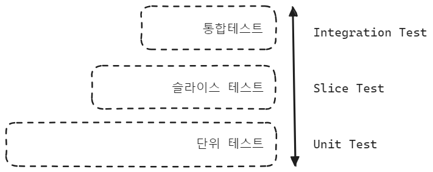

## 슬라이스 테스트란?

슬라이스 테스트는 스프링에서 제공하는 테스트 기능 중 하나입니다. 두꺼운 치즈를 자르면 하나의 슬라이스가 되듯 여러 복합적인 기능 중 하나의 단면에 대한 레이어를 테스트한다는 의미를 가지고 있습니다. 

슬라이스 테스트는 스프링 프레임워크에서 제공하는 기능입니다. 예를 들면 Controller 의 경우에는 MockMVC 또는 @WebFluxTest 테스트를 통해 검증할수 있고, Repository 는 @DataR2dbcTest, 레디스는 @DataRedisTest, MongoDB 는 @DataMongoTest 애노테이션을 통해서 그 기능을 제공해줍니다. 

Web MVC

- MockMVC
- @WebFluxTest

Data Access Layer

- @DataR2dbcTest
- @DataRedisTest
- @DataMongoTest

 

## Controller, Data Access Layer

Service 나 내부 컴포넌트 들은 정해진 입력에 대해 정해진 동작을 하는 역할을 하게끔 작성이 가능합니다. 그런데 Service 계층이 아닌 Controller, Repository 는 외부의 입력을 받습니다. 

**Controller** 

Controller 는 주어진 API 에 대한 비즈니스 요구사항에 맞는 요청과 응답을 검증해야 하는데 이 때 Service 및 내부 Component 들에 대해서는 Mocking 을 해서 테스트를 수행합니다. Controller 가 속한 프리젠테이션 레이어는 비즈니스 요구사항에 맞는 요청의 형식이나 응답코드, 응답 형식이 요구사항이 변할 때마다 대응이 가능해야 하는데 이에 맞는 테스트를 하는 영역입니다. 

그런데 이 Controller 는 단순히 요청 응답만 테스트 하는 것이 아니라 Netty 또는 Tomcat 컨테이너 위에서 잘 구동되는지 역시 검증이 가능해야 합니다. 따라서 단순한 기능의 검증을 넘어서 WAS 레벨에서의 테스트까지 수행해야 합니다. 이렇게 웹 컨테이너에서부터 API 의 비즈니스 요건 테스트에 대해서 Webflux 에서는 @WebFluxTest 라는 기능을 제공해줍니다. 

 

**Data Access Layer** 

Data Access Layer 는 R2DBC 와 같은 데이터베이스 클라이언트를 통해서 데이터베이스라고 하는 이종의 머신과 통신을 한 결과를 데이터로 응답합니다. Data Access Layer 계층에서는 DBMS 와 통신을 하는 것 외에도 실제 쿼리가 잘 짠 것인지도 테스트를 해봐야 합니다. 쿼리의 검증은 단순히 Java 코드로만은 검증이 불가능합니다. 실제로 존재하는 Database 를 소규모로 구성해서 테스트를 해봐야 합니다. 

이렇게 Data Access Layer 에서는 실제 쿼리를 검증하는 테스트 코드, Database 접근 로직 등을 테스트하기 위해서 `@DataR2dbcTest`, `@DataRedisTest`, `@DataMongoTest` 를 제공해주고 있습니다. 

 

